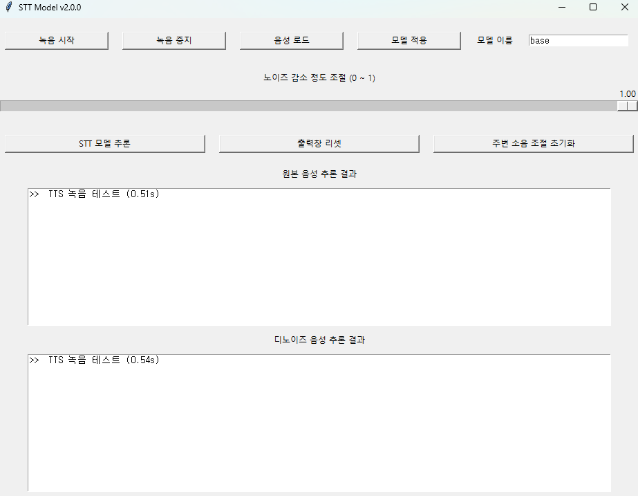
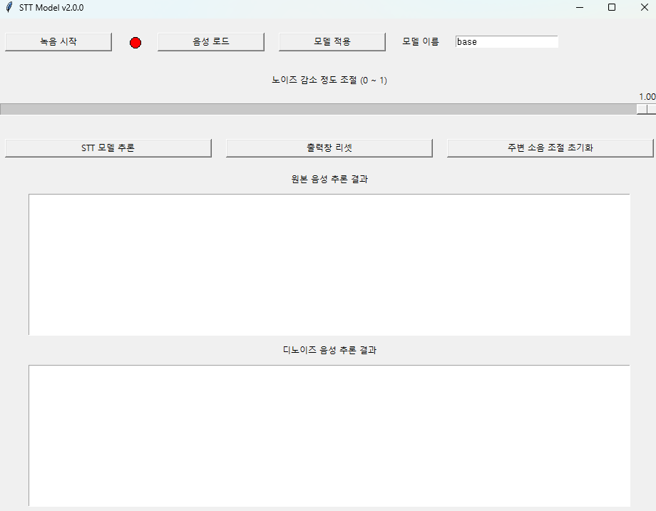

# RealTime_STT_with_Whisper

OpenAI의 Whisper 모델과 VAD(Voice Activity Detector)를 사용해 구현한 실시간 STT 모델

## 프로젝트 개요
이 프로젝트는 OpenAI의 Whisper 모델을 사용하여 음성을 텍스트로 변환하는 실시간 STT(Speech-to-Text) 시스템을 구현한 것입니다. VAD(Voice Activity Detector)를 통해 자동으로 녹음을 중지하는 기능도 포함되어 있습니다.

## 주요 기능
- **녹음 시작**: 음성 활동 감지 모델을 통해 자동으로 녹음을 시작하고, 1초 동안 음성이 없으면 자동으로 녹음을 중지합니다.
- **음성 로드**: 사전에 저장된 음성 파일을 로드하여 STT 기능을 수행할 수 있습니다.
- **모델 적용**: 다양한 Whisper STT 모델을 적용할 수 있으며, 실시간에 유리한 tiny, base 모델을 추천합니다.
- **STT 모델 추론**: 녹음되거나 로드된 음성을 STT하여 텍스트로 변환합니다.
- **출력창 리셋**: 텍스트 출력 창을 초기화합니다.
- **주변 소음 조절 초기화**: 주변의 마이크 소음을 조절하여 마이크를 최적화합니다.
- **노이즈 감도 조절**: 0에서 1 사이로 디노이즈 감도를 조절할 수 있습니다.

## 기능 설명 및 데모 영상
1. **STT GUI 구현 테스트 영상**
    1. 음성 활동 감지(VAD)를 통한 자동 녹음 중지 기능 설명
       [](https://www.youtube.com/watch?v=WDDFrGd1XBg)
    2. 음성 로드 기능 설명
       [](https://www.youtube.com/watch?v=0IZx-0-FGZI)
    3. 모델 변경 기능 설명
       [](https://www.youtube.com/watch?v=sQlIkdLi9Bs)
    4. 디노이즈 관련 기능 설명
       [](https://www.youtube.com/watch?v=N6eltE5N9MM)

2. **싱글보드 STT 구동 테스트 영상**
    1. [](https://www.youtube.com/watch?v=Kit1lvTWxxg)
    2. [](https://www.youtube.com/watch?v=UtyPmrirj_0)
    3. [](https://www.youtube.com/watch?v=MfX-K7kKF_Y)

## 설치 및 실행 방법
이 프로젝트를 로컬에서 실행하려면 아래 단계를 따르세요.

### 1. 환경 설정
- Windows11 Anaconda python 3.10 환경 기준으로 설명합니다. 다른 환경에 설치할 경우 참고 바랍니다.
- 먼저 다음 링크에서 "Microsoft Build Tools"를 설치하십시오: https://visualstudio.microsoft.com/ko/visual-cpp-build-tools/
- "C++를 사용한 데스크톱 개발"만 설치하면 됩니다.
- 이후 아나콘더 터미널을 열고 아래와 같이 설치를 진행합니다.

```bash
conda create -n whisper python=3.10
y
conda activate whisper
pip install -r requirements.txt
```

## 모듈 구동 방법
```bash
python main.py
```

# 버전 히스토리
## 240618_v1
240618 실시간 STT 테스트

[문제점]
- tmp.wav를 저장해서 불러오는 방식이라 그 과정에서 계속 알 수 없는 에러가 발생(읽는 타이밍이 꼬이는듯)
- 마지막 단어를 배출하지 못하는 특성 있음. 그리고 10초가 지나면 잊혀짐
- wav파일을 넣었을 때랑, tmp.wav를 실시간으로 불러왔을 때랑 추론 결과가 다른 것 같음. 전자가 성능이 더 좋은 것 같음

## 240619_v2
GUI로 STT 테스트
- faster_whisper로 cpu통해서 tiny, base 모델 테스트 가능하게 gui 구성
- exe파일 생성

## 240619_v3 
노이즈 제거 기능 테스트 중. (녹음 중지 버튼 삭제 필요. 대화가 끝낫다는 사실 인지 기능 추가 필요)
- main.py기능은 안만짐
- '잡음 제거 테스트.ipynb' 하나 만들어서 잡음 제거 기능 테스트 중임
- 통합 GUI 모듈 제작함


## 240705_v4
'녹음 중지'버튼 제거 목적
- 녹음 중지버튼이 제거되고 VAD를 통해 목소리를 감지하여 n초동안 음성이 없을 경우 자동으로 녹음을 종료함
- webrtcvad 라이브러리는 사용하여 구현함
- Audio_record Class의 _vad 함수에 상세 내용 있음
- 녹음 시작 시 LED 상태창이 빨간불로 바뀌고, 녹음이 종료되면 회식으로 꺼짐


## 240715_v5
- main과 utils 폴더 분리
- 필요 없는 임시파일들 모두 정리
- requirments.txt 완성(가상환경 새로 만들어서 제대로 동작하는지 테스트 완료)
- README.md 완성